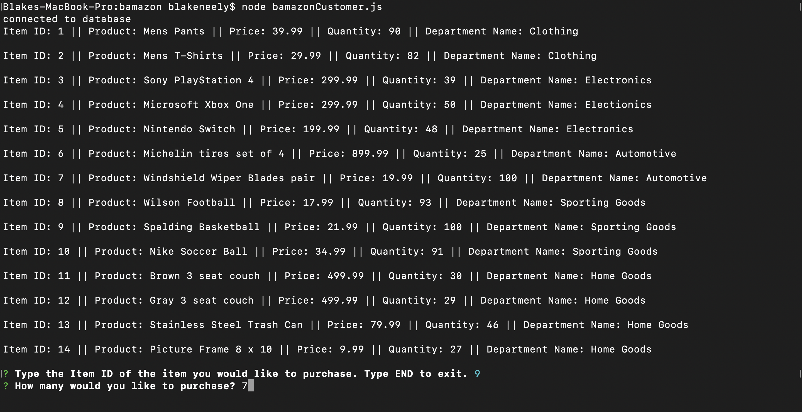
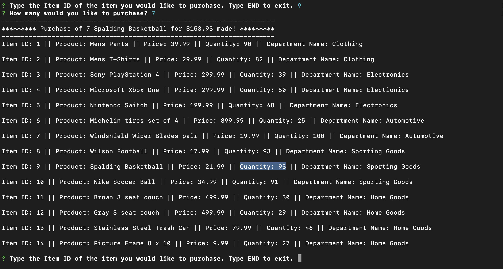
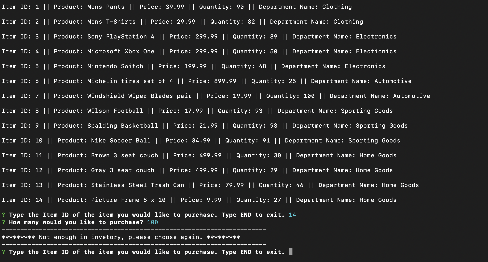
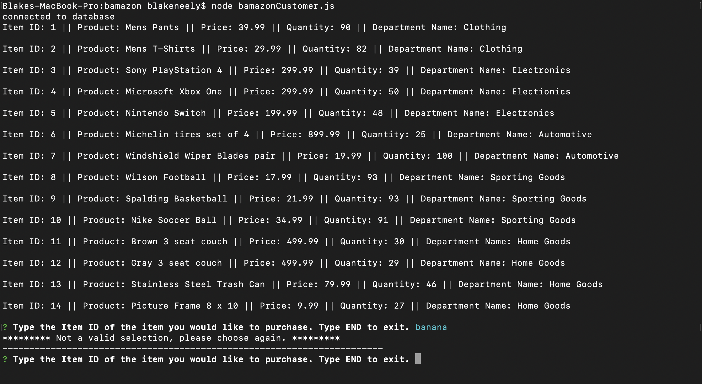

# bamazon

## Description
This Node app is a working database for an Amazon type store. You can place orders with simple commands and it will deduct the amount of products ordered from the database and return the amount you spent placing the order. It is built with JavaScript with dependencies of MySQL and Inquirer. 

Inquirer will ask the questions of which product to order and how many, MySQL handles keeping up with the database. Edit the seeds.sql file to change which products you'd like to house in the database for ordering. JavaScript handles the logic of also checking to see if there are enough products on your order to fulfill as well as any commands that don't make sense. To exit the app just type END.

### Video Demo
<a href="https://drive.google.com/open?id=1WGD1pO8QwgLbTLK3fPiM8NzjJI1EZ43R">Click here</a> to check out a video of it running.

### Screenshots of bamazon running

Default view showing full invetory of items for sale, Inquirer is asking to type the Item ID of the item you want to buy followed by asking how many you'd like to buy:

The order has been placed here. Near the top you can see amount, name, and total price of the product ordred. The database has also been updated for that product's quantity available. The app continues to run asking to place another order:

Here you can see what happens when a quantity entered is more than is housed in the database. At the bottom the app tells you there isn't enough inventory and then continues to run asking to place another order:

At the bottom of this last picture you can see what happens when something is entered that the app isn't expecting. I've just used the word "banana" for effect:

